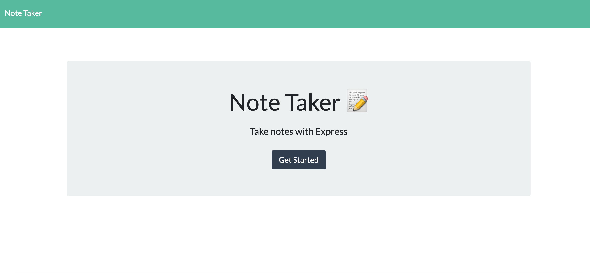

# noteTaker
Note Taker - creates a toDo list and allows user to add and delete from it
# Instruction to run the app
* clone the project repo .
* run 'npm install' to install the dependencies required from package.json.
* run 'node server.js'.
* once the server is listening , go to this endpoint on a browser - http://localhost:8059/ and follow the instruction on the website.

